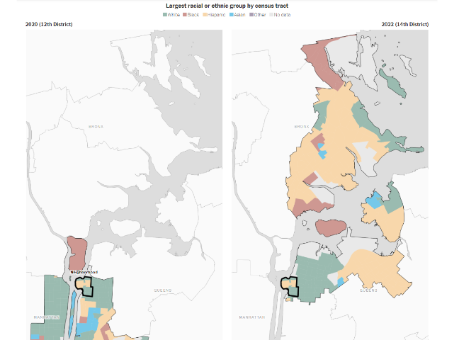

Project Proposal Template
================
Eric Hughes

[<i class="fa fa-file-code-o fa-1x" aria-hidden="true"></i> Download
this file as a
template](http://adamwilson.us/SpatialDataScience/scripts/Project_ProposalTemplate.Rmd).

# Introduction to problem/question

Access to healthy food is not equal across all regions. Many factors
influence food access such as vehicle access, proximity of quality
grocery retailers, and income. The most basic measure of food access is
proximity to supermarkets. Supermarkets have the resources to carry a
wide range of produce and have affordable prices which makes their
presence a good measure of local food security.

This project aims to look at Buffalo resident’s proximity to
supermarkets by their median income.To do this, Buffalo residents will
be grouped together in five income brackets and the average distance to
a supermarket for each bracket will be calculated for various modes of
transportation. Demographic information about each bracket will also be
examined to better explain the food disparity phenomenon.

# Inspiring Examples

## Example 1

``` r
library(png)
img <- readPNG("img/Example_1.png")
grid::grid.raster(img)
```

<!-- -->

This graphic does a good job at making the spatial relationship very
apparent. This was created using dodgr and I think I could make a
similar graphic specific to my project subject.

## Example 2

``` r
library(png)
img <- readPNG("img/Example_2.png")
grid::grid.raster(img)
```

<!-- -->

I like how the background is grey scale and the important data is
colorized in easily differential color assignments. It’s very simple but
clean. I believe this could be achieved via ggplot() with use of the
RColorBrewer package.

# Proposed data sources

- US Census Bureau will provide census tract data of median household
  income, as well as demographic data, for Buffalo

- Open Data Buffalo for Neighborhood Boundary Shapefile

- ESRI Business Analyst will provide supermarket data

# Proposed methods

- Data cleaning and processing

- Plot data for median household income

- Plot supermarket data

- Clip data to Buffalo boundary

- Use the dodgr package to determine travel distances

- Analyze and plot the data for each mode of transport

# Packages

    library(tidyverse)
    library(ggplot2)
    library(ggmap)
    library(maptools)
    library(ggthemes)
    library(plyr)
    library(dplyr)
    library(grid)
    library(gridExtra)
    library(scales)
    library(sp)
    library(sf)
    library(RColorBrewer)
    library(dodgr)
    library(leaflet)

# Expected results

I expect to generate choropleth maps for the income brackets that show
which brackets have the shortest distances to supermarkets via the
different modes of transportation. I will also create several
accompanying bar graphs of demographic data per income bracket. Tables
will also be provided that show a breakdown of the data generated from
my results.
